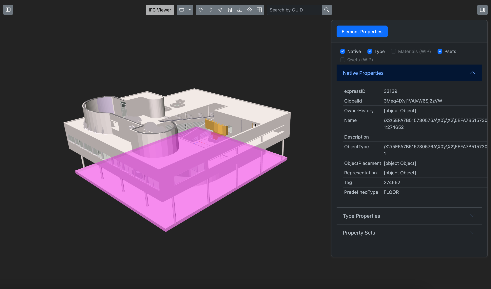

## IFC Viewer

A lightweight web-based .ifc file viewer, based off [IFC.js](https://github.com/IFCjs). Built using a combination of three.js, ifc.js and bootstrap components.

Demo at [https://ifc-viewer.vercel.app/](https://ifc-viewer.vercel.app/).

Current features: custom file upload, grid/axes toggles, element property traversal and filtering, file/project structure, GUID lookup/selection, custom element subset export to JSON.

